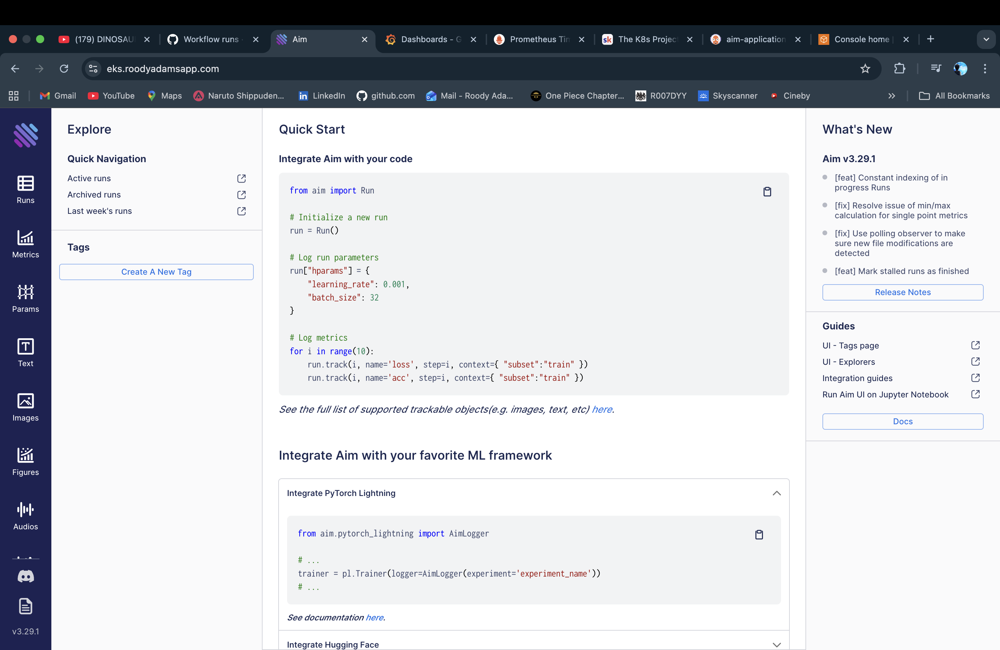
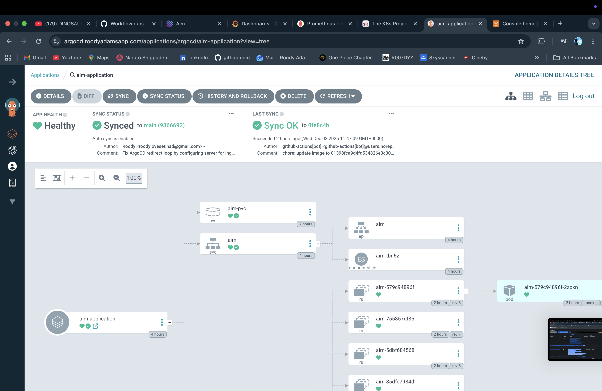
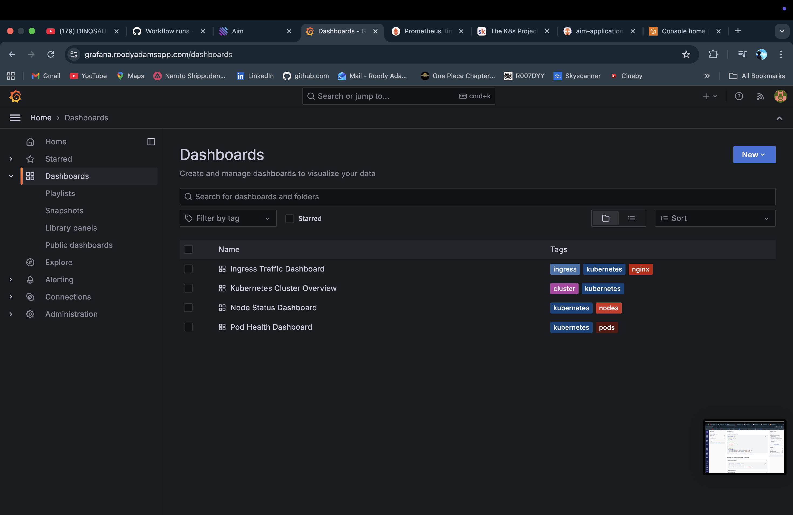
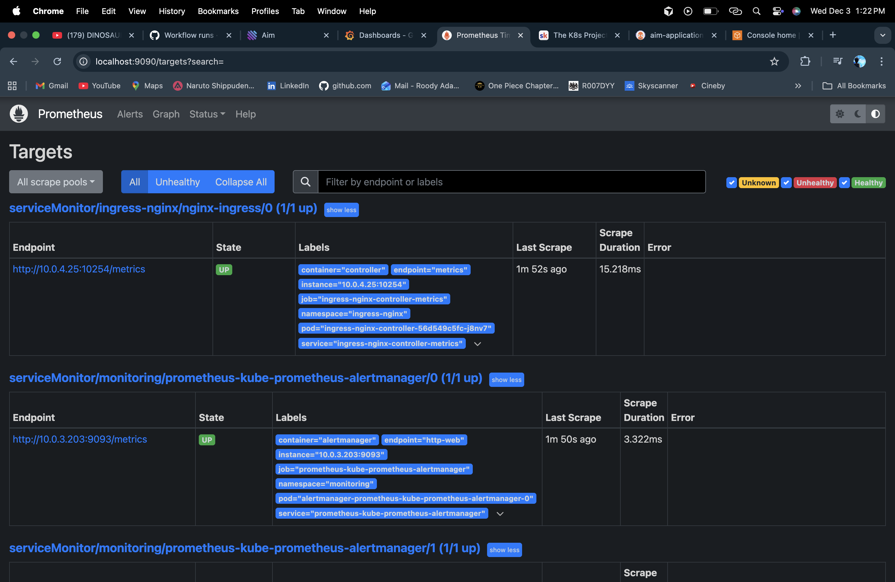

# Cloud-Native EKS Application Platform

A production-ready, cloud-native application platform deployed on Amazon EKS (Elastic Kubernetes Service) using Infrastructure as Code, GitOps automation, and comprehensive monitoring and observability.

## Overview

This project demonstrates a complete cloud-native infrastructure setup for deploying containerized applications on AWS EKS. It includes automated infrastructure provisioning, CI/CD pipelines, GitOps workflows, dynamic DNS management, SSL/TLS certificate automation, and full-stack monitoring with Prometheus and Grafana.

## Architecture


The architecture diagram illustrates a production-ready cloud-native infrastructure deployed on AWS EKS. The system is built with a multi-tier architecture featuring public and private subnets across three availability zones for high availability. External traffic enters through a Classic Load Balancer in the public subnets, which routes requests to the NGINX Ingress Controller. The ingress controller then forwards traffic to application pods running in private subnets on EKS worker nodes. A NAT Gateway enables outbound internet connectivity for resources in private subnets, while the EKS control plane (managed by AWS) orchestrates all Kubernetes resources. The platform integrates GitOps with ArgoCD for automated deployments, Prometheus for metrics collection, and Grafana for visualization, all running as containerized workloads within the cluster.

### Application



The AIM (AI/ML Experiment Tracking) application is the core workload running on the EKS cluster. This containerized application is deployed via Helm charts and managed through ArgoCD's GitOps workflow. The application is accessible via HTTPS at `eks.roodyadamsapp.com` through the NGINX Ingress Controller, with automated SSL/TLS certificates managed by Cert-Manager. The application leverages persistent storage via EBS volumes and scales dynamically based on demand.

### GitOps with ArgoCD



ArgoCD provides declarative GitOps continuous delivery for the platform. It automatically synchronizes the Kubernetes cluster state with the Git repository, ensuring that any changes committed to the repository are automatically deployed to the cluster. ArgoCD monitors the Git repository for changes to Helm charts and Kubernetes manifests, then applies those changes to maintain the desired state. This enables automated deployments, rollbacks, and ensures Git remains the single source of truth for infrastructure and application configurations.

### Monitoring with Grafana



Grafana provides comprehensive visualization and monitoring dashboards for the entire platform. It integrates seamlessly with Prometheus to display real-time metrics including cluster health, pod resource usage, ingress traffic patterns, and application performance. Pre-configured dashboards offer insights into node status, pod health, and HTTP request metrics. Grafana is accessible via HTTPS at `grafana.roodyadamsapp.com` and provides a unified view of the platform's operational status.

### Metrics Collection with Prometheus



Prometheus serves as the core metrics collection and monitoring system for the platform. It scrapes metrics from Kubernetes components including pods, nodes, namespaces, and services, providing comprehensive observability into cluster performance and application health. Prometheus collects time-series data that powers Grafana dashboards and enables alerting through AlertManager. The system monitors NGINX Ingress traffic, application metrics, and infrastructure health, ensuring proactive issue detection and resolution.

## Features

### Infrastructure as Code
- Modular Terraform configuration for reusable infrastructure components
- Remote state management with S3 and DynamoDB for state locking
- Support for infrastructure lifecycle management (create, update, destroy)

### CI/CD Automation
- **Terraform Pipeline**: Automated infrastructure provisioning with validation and formatting checks
- **Application Pipeline**: Security scanning (Checkov, Trivy), Docker image builds, and GitOps deployments

### Security
- IAM Roles for Service Accounts (IRSA) for secure AWS resource access
- KMS encryption for secrets and ECR repositories
- Automated security scanning with Checkov and Trivy
- Security groups with least-privilege access

### Monitoring & Observability
- Prometheus for metrics collection from pods, nodes, namespaces, and services
- Grafana dashboards for:
  - Cluster overview and node status
  - Pod health and resource usage
  - Ingress traffic and HTTP metrics
- Custom alert rules for proactive monitoring

### GitOps
- ArgoCD for declarative application deployments
- Git as the single source of truth for infrastructure and application state
- Automated synchronization of cluster state with Git repository

## Future Enhancements

### EKS Endpoint Security
Currently, the EKS API endpoint is configured with public access (`public_access_cidrs = ["0.0.0.0/0"]`) for operational simplicity. While this is secured through IAM authentication and Kubernetes RBAC, a production enhancement would implement more restrictive network access controls. This could include:

- **IP-based restrictions**: Restricting access to specific trusted IP addresses (e.g., office/home IPs) using CIDR blocks
- **Dynamic GitHub Actions IP management**: Automatically fetching and updating GitHub Actions IP ranges from `api.github.com/meta` to ensure CI/CD pipelines continue functioning while maintaining security
- **VPC endpoints**: Implementing AWS PrivateLink VPC endpoints to enable private connectivity between GitHub Actions runners and the EKS cluster, eliminating public internet exposure entirely

These enhancements would demonstrate advanced understanding of defense-in-depth security principles and network segmentation strategies in cloud-native environments.

### Container Security
The application container currently runs with default permissions. A production enhancement would implement the principle of least privilege by running containers as a non-root user. This involves creating a dedicated user in the Dockerfile and configuring the container to run with that user's permissions, significantly reducing the attack surface in the event of a container compromise.

## Prerequisites

- AWS Account with appropriate permissions
- Terraform >= 1.5.0
- kubectl configured for EKS access
- Helm 3.x
- GitHub repository with Actions enabled
- AWS credentials configured (for local development)

## Project Structure

```
.
├── terraform/                 # Infrastructure as Code
│   ├── main.tf               # Root module configuration
│   ├── variables.tf          # Variable definitions
│   ├── outputs.tf           # Output values
│   ├── modules/             # Reusable Terraform modules
│   │   ├── vpc/             # VPC and networking
│   │   ├── eks/             # EKS cluster
│   │   ├── iam/             # IAM roles and policies
│   │   ├── security-groups/ # Security group rules
│   │   ├── nginx-ingress/   # NGINX Ingress Controller
│   │   ├── cert-manager/    # Cert-Manager and ClusterIssuers
│   │   ├── external-dns/     # ExternalDNS configuration
│   │   ├── prometheus/       # Prometheus stack
│   │   ├── grafana/         # Grafana deployment
│   │   └── argocd/          # ArgoCD GitOps
│   └── bootstrap/           # Bootstrap resources (ECR, IAM roles)
├── kubernetes/               # Kubernetes manifests
│   ├── apps/                # Application Helm chart
│   ├── argocd/              # ArgoCD application definitions
│   ├── monitoring/         # Prometheus and Grafana configs
│   └── nginx-ingress/       # NGINX Ingress values
├── aim/                     # Application source code
├── .github/workflows/        # CI/CD pipelines
│   ├── terraform.yml        # Infrastructure deployment
│   └── application.yml     # Application build and deploy
└── .checkov.yml             # Security scanning configuration
```